# MIDI-eval Times — AI Player Piano Ecosystem

A professional, high-performance ecosystem for managing, cleaning, editing, and performing MIDI files on a Yamaha Disklavier player piano. It features an advanced hybrid MIDI editor, multi-stem MP3 backing track integration, direct PC audio server capabilities, and smart dynamic playlists.

---

## Critical Hardware Safety & Cleaning Engine

> [!WARNING]
> **UNPROTECTED RAW MIDIs CAN DAMAGE PLAYER PIANO HARDWARE!**
> Overly dense MIDI files (with many simultaneous notes) or notes played at 100% maximum velocity can overload the solenoid driver boards of physical player pianos. Playing raw, uncleaned MIDIs can cause driver board components (like solenoids or fuses) to burn out, requiring expensive hardware replacements.

To safeguard your piano, this ecosystem implements a strict, multi-stage **Cleaning & Normalization Engine** ([clean_midi.py](file:///C:/app/player-piano-app/tools/clean_midi.py)):

1. **Velocity Capping & Scaling:** The engine scales note velocities to fit safe, pre-calibrated physical ranges (by default, mapping velocity between a floor of 18 and a ceiling of 60 or 90 depending on the profile) to protect physical hammers and solenoids.
2. **Track & Note Density Stripping:** If a MIDI file contains too many simultaneous notes or notes across a large number of instrument tracks (which can quickly overload physical piano hardware), the engine automatically strips out the least active tracks (those with the fewest notes). This reduces note density to safe levels while preserving the core arrangement, which is rarely noticeable on solo piano music.
3. **Strict Playback Rules:** The backend is configured to **never play RAW files directly**. Original raw files are stored strictly as reference templates for future re-cleaning, metadata extraction, or manual editing.
4. **Pedal Clank Mitigation:** Standard MIDI files often trigger abrupt pedal down/up actions, causing loud mechanical "thunks." The cleaning engine applies continuous, syncopated (after-pedal) curves and soft-release envelopes to make physical pedaling quiet and smooth.

---

## Key Features & Workflows

> [!NOTE]
> **The Core Experience:** While this ecosystem provides advanced multi-track editors and audio-alignment tools, the **standard MIDI files and playlists are by far the most stable, dependable, and frequently used features**. The main **Files Screen** displays a list composed purely of full, clean MIDI files. Being able to download any MIDI from the web, upload it, and play it on the piano within seconds is the rock-solid core of this system.

### Library & Workspace Overview
A "Files-style" workspace designed for easy navigation and comprehensive library management:
* **Bulk Actions:** Supports bulk file uploads, bulk deletions, and bulk additions to playlists directly from the file list screen.
* **Instant Playback Control:** Click a file once to play it locally through device speakers, or long-press to play it directly on the physical Disklavier.
* **Normalized Search:** Find files instantly with responsive search logic.
* **Track Information & Editing:** Access detailed track information views to edit metadata and configuration settings.

<p align="center">
  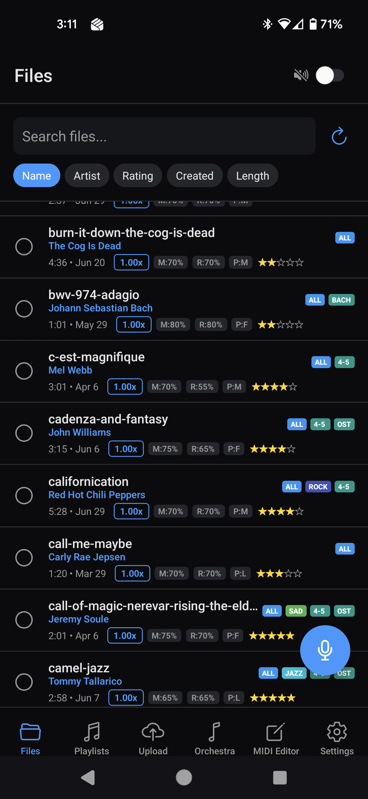
  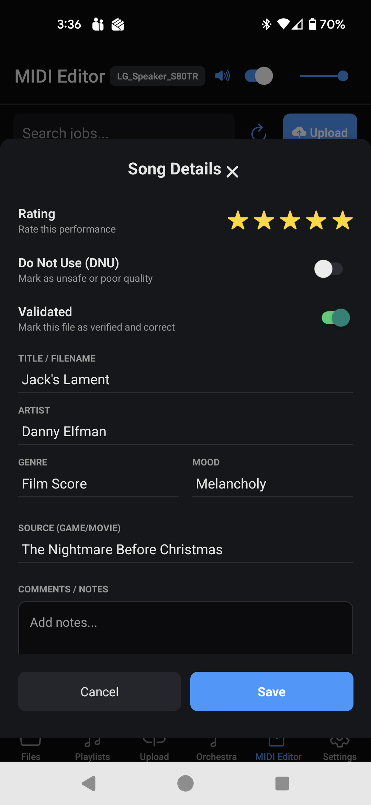
</p>

### Smart & Dynamic Playlists
Organize and enjoy your collection with a responsive, metadata-driven playlist builder featuring AND-logic filtering and a suggestive query builder.
* **Manual & Dynamic Building:** Playlists can be manually curated or generated dynamically using metadata conditions. By default, standard MIDI files that match the metadata conditions will automatically populate (note that the mobile frontend must be pulled to refresh to render new additions).
* **Visual Metadata Tags:** Playlists automatically add tag labels to files on the main Files Screen, helping identify associated collections at a glance.
* **Hybrid Track Integration:** As long as a hybrid (MIDI + MP3) song is marked as **validated**, it can be manually added to playlists or will automatically populate if its metadata matches the dynamic criteria. Validated hybrid tracks launch utilizing global speaker and sync configurations automatically.
* **Performance Disclaimer:** Once your music library becomes extremely large, loading massive dynamic playlists can be slow on mobile devices, sometimes triggering the OS "App Not Responding / Close App" popup. Fortunately, since the mobile app acts purely as a UI remote, closing and restarting the app **will not disrupt active piano playback**. Playlist expansion and loading is nearly instantaneous in the web app version.

<p align="center">
  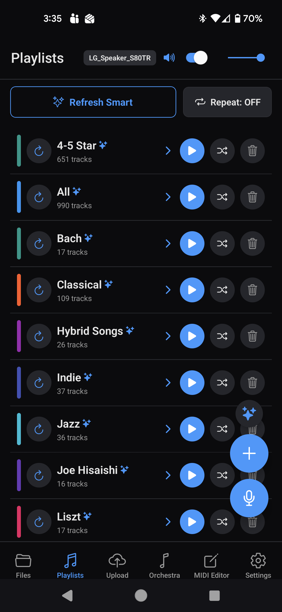
  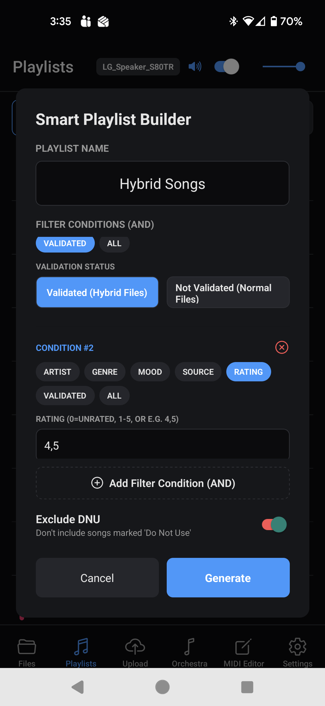
</p>

### Advanced MIDI Editor & Hybrid Sync
For complex MIDI arrangements, bypass the automated cleaning limits and take full manual control:
* **Custom Track Routing:** Route individual MIDI tracks selectively. Send the piano parts to the physical Disklavier, and route backing instruments (e.g., cellos, violins, drums) to the speaker system to play simultaneously.
  
  <p align="center">
    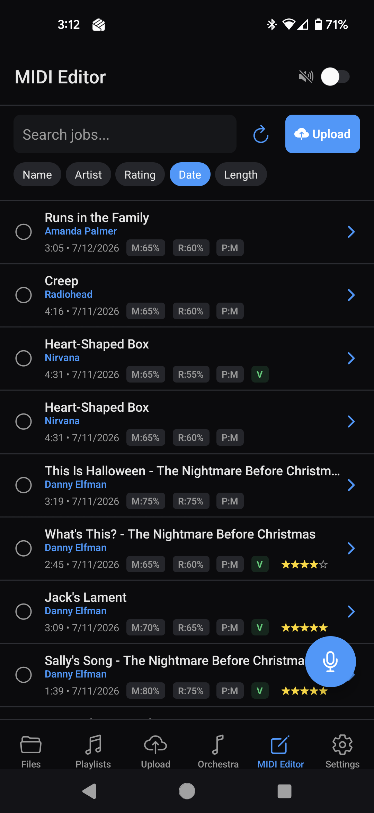
    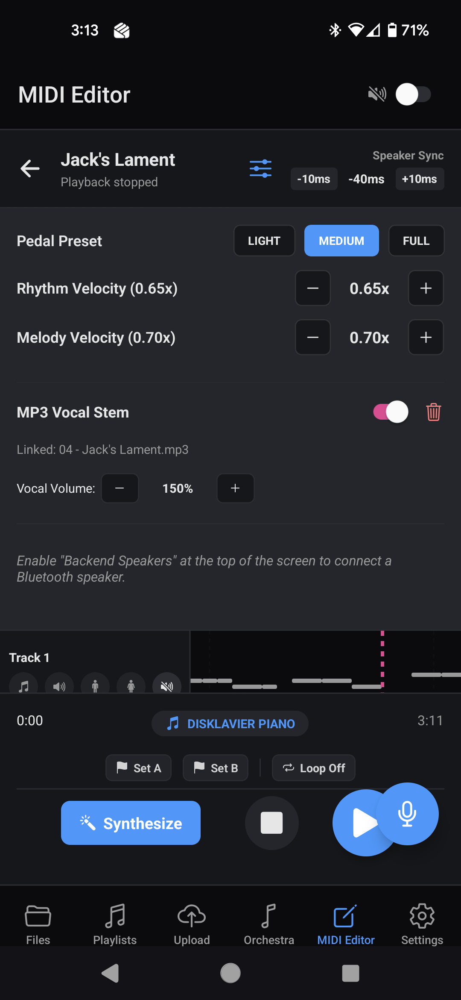
  </p>
  
  <p align="center">
    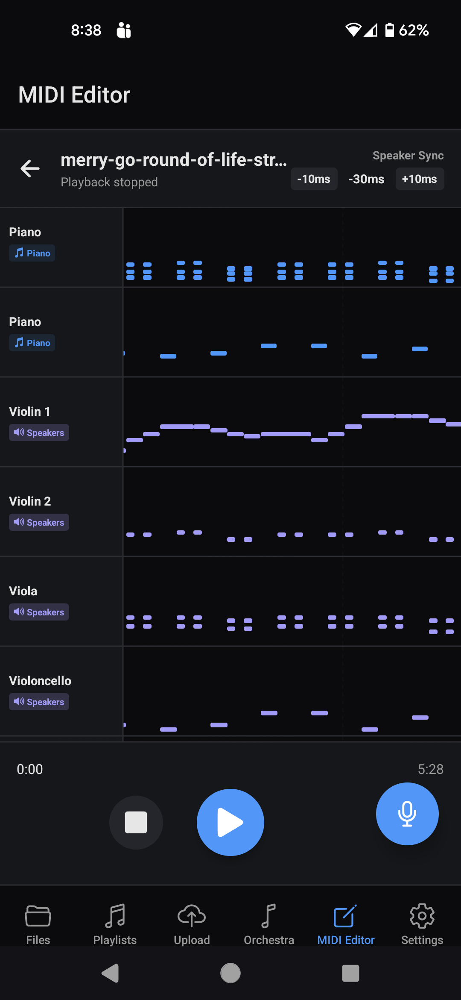
  </p>
  
* **Waveform-Level Breaklines:** Perfect the synchronization between backing audio and the piano. Add **Breaklines** anywhere on the audio waveform to stretch/shift the track (adding/removing milliseconds) to align vocals or instrument beats to the exact millisecond.
  
  <p align="center">
    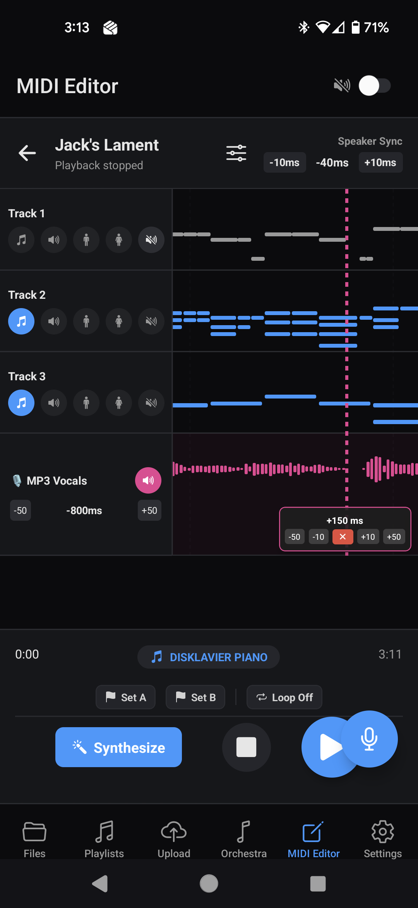
  </p>

* **Smart Vocal Track Swapping:** Align your MIDI using a clean vocal-only stem, and then swap the audio track for a full instrument/drum/bass mix. The system automatically preserves all your breakline alignments. *(Note: breakline stretching will introduce audio distortions; the severity depends heavily on matching original MP3 and MIDI lengths).*
* **Multitasking Local Playback:** Play tracks locally on your phone (synthesized via FluidSynth) at any time—even while the physical piano is performing a song. This is highly useful for verifying how a clean MIDI sounds when converted to piano before sending it to the physical Disklavier.

### Direct Server-PC Audio System
Playing backing tracks through a phone connected to Bluetooth speakers is susceptible to latency, drift, and dropouts as the user moves around. 
* **Zero-Drift Local Output:** Route backing audio directly through the server PC's hardware outputs to a static room speaker system to keep audio in perfect sub-millisecond sync with the BLE-connected piano.
* **Automatic Power Management:** The backend auto-connects to the speaker system when playback starts and auto-disconnects when idle.
* *Caveat:* If your speaker system goes into a standby sleep state, there may be a minor audio latency adjustment on the first song played after a period of inactivity.

### App Settings & Configuration
Manage system preferences, connections, security, and recovery actions:
* **Visual Theme:** Toggle dark mode for comfortable navigation in low-light environments.
* **Connections:** Configure communication parameters. Note that the mobile application relies on a **low-latency Bluetooth connection** to the player piano.
* **Security & Keys:** Set your master server password (default is `piano`) and your Gemini API key.
* **Backups:** Perform manual database and configuration backups (in addition to the system's **daily automatic backups**).
* **Bluetooth Target Hard Reset:** A safety reset switch designed for rare situations where a crash or disconnect causes the piano's Bluetooth connection to get stuck, preventing reconnects to a restarted server.

<p align="center">
  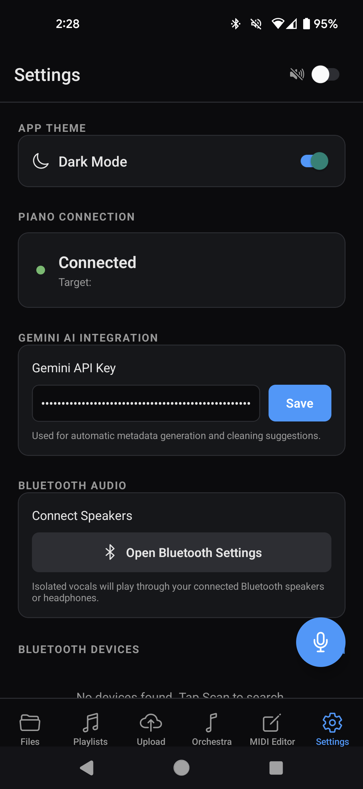
  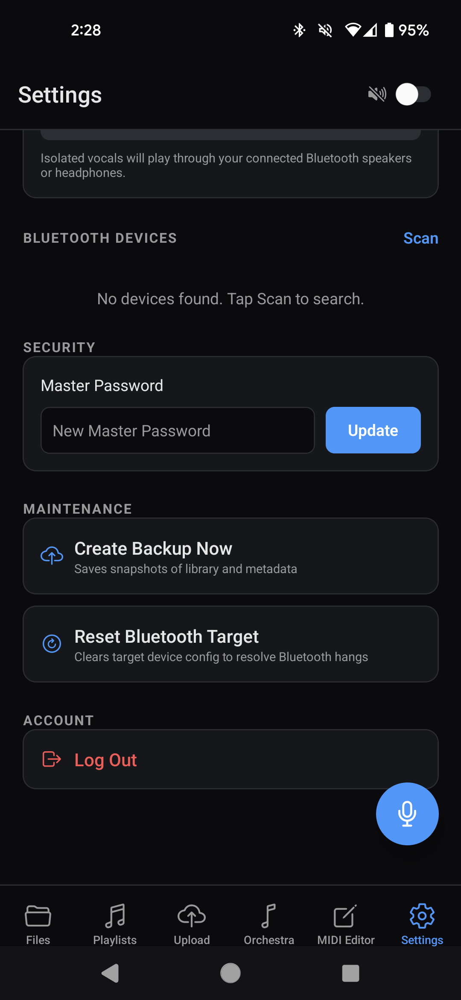
</p>

### Legacies & Work-in-Progress (Disclaimer)
This application has been developed experimentally over a long period. As such, some experimental features are less polished:
* **MP3 Orchestrator (Automatic Transcription/Sync):** Originally designed to automatically transcribe MP3 audio into piano MIDIs and perform wave-anchored Dynamic Time Warping (DTW) to sync them. Due to the limitations of audio-to-piano transcription, this automated process can cause "rubber-banding" timing errors and forces the piano to play vocal notes. **This feature is semi-legacy;** the MP3 Orchestrator is now primarily recommended as a utility for stripping vocals/stems to load into the manual MIDI Editor.
  
  <p align="center">
    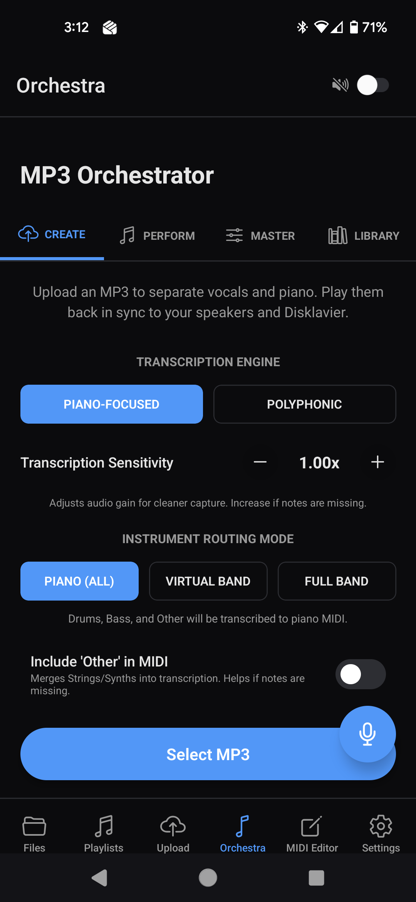
  </p>

* **Breakline Audio Distortion & Gaps:** Adding adjustments in breaklines will introduce audio distortions. The level of distortion depends heavily on how well the lengths of your original MP3 and MIDI match (closer is better). In some cases, extreme breakline values can also cause the audio generator to repeat the previous audio chunk slightly.
* **Mobile Screen Space:** Due to the dense layouts of waveforms, track lists, and editors, some screens can feel cramped on mobile devices. Visual layouts on arbitrary phone sizes are untested. The web app version (`player-piano-native` compiled for web) is highly recommended for doing extensive editing work.
* **Gestures:** The app makes heavy use of **long-press gestures** to delete items, trigger settings, and access contextual menus.
* **AI Vocal Synthesis (Male/Female Tracks):** The options to generate male or female vocal tracks within the MIDI Editor were part of an experiment to see if AI voice models could render high-quality singing from MIDI notes. Currently, the generated vocals do not sound production-grade, but the options are left in the workspace for future experimentation.
* **Roadmap:** Planned future updates and optimizations:
  * **Section Deletion:** Direct deletion of MIDI/MP3 sections utilizing A/B loop lines.
  * **Note Muting:** Option to mute individual MIDI notes within the editor.
  * **Button Hold-to-Repeat:** Add a hold-to-repeat gesture on the `+` and `-` timing adjustment buttons in the MIDI Editor to speed up multi-second backing offset adjustments.
  * **Smart Speaker Pre-Connection:** A background process to check the upcoming song in the playlist; if it is a validated hybrid track (`validated === true`), the system will pre-connect to the backend speaker system to eliminate sleep/standby latency before playback starts.
  * **Midi Editor Playlist Tags:** Display playlist tag labels in the MIDI Editor file list screen, identical to the main Files Screen view.

---

## Best Practices & Sourcing

* **High-Quality MIDIs:** It is highly recommended to source MIDI files from community sites like **MuseScore** to get clean, multi-track arrangements.
* **Gemini AI Integration:** Configure the Gemini API backend! Gemini automatically parses newly uploaded titles, assigns tags/genres, and calculates optimal velocity/pedal cleanup parameters to drive your smart playlists.
* **Hardware Calibration:** Every Disklavier has a slightly different solenoid and pedal response. If the default presets in [clean_midi.py](file:///C:/app/player-piano-app/tools/clean_midi.py) are too loud or soft, you can adjust the `PEDAL_PRESETS` and velocity ceilings directly in the Python code.

---

## Project Structure

* `player-piano-app/` — FastAPI backend, AI processing engine, and ML models.
* `player-piano-native/` — Native mobile application (Expo/React Native).
* `storage/` — Persistent storage for raw MIDIs, processed outputs, separated audio stems, and job databases (ignored from git tracking except for default SoundFonts).
* `tools/` — Utility scripts for MIDI inspection, re-cleaning, and model downloading.

---

## Setup & Installation

### Backend Setup
1. **Python 3.11 (Required):** Ensure Python 3.11 is installed (newer versions like 3.14 are incompatible with specific ML dependencies like Torch < 2.1).
2. **Create Environment:**
   ```bash
   cd player-piano-app
   py -3.11 -m venv .venv
   .\.venv\Scripts\activate
   ```
3. **Install Dependencies:**
   ```bash
   pip install -r requirements.txt
   ```
4. **Download Transcription Checkpoint (Required for Windows):**
   Run this Python command to pre-download the model checkpoint:
   ```bash
   python -c "import urllib.request, pathlib; url='https://zenodo.org/record/4034264/files/CRNN_note_F1%3D0.9677_pedal_F1%3D0.9186.pth?download=1'; p = pathlib.Path.home() / 'piano_transcription_inference_data'; p.mkdir(exist_ok=True); print('Downloading checkpoint...'); urllib.request.urlretrieve(url, p / 'note_F1=0.9677_pedal_F1=0.9186.pth'); print('Done!')"
   ```
5. **Install FluidSynth (Required for local audio rendering):**
   * Download the latest Windows release (e.g., `win10-x64` zip) from [FluidSynth Releases](https://github.com/FluidSynth/fluidsynth/releases).
   * Extract it to `C:\fluidsynth` or a folder of your choice (e.g. `C:\app\fluidsynth`).
   * Define the environment variable `FLUIDSYNTH_BIN` pointing to `fluidsynth.exe` (defaults to `C:\fluidsynth\bin\fluidsynth.exe`).
6. **Install FFmpeg (Required for audio separation & voice conversion):**
   * Install via winget: `winget install Gnu.FFmpeg` (or download from [Gyan.dev](https://www.gyan.dev/ffmpeg/builds/)).
   * Ensure `ffmpeg.exe` is added to your system's `PATH`.
7. **Download RVC Voice Models (Optional, for vocal rendering):**
   Run the model downloader script:
   ```bash
   python tools/download_rvc_models.py
   ```
8. **Start the Server:**
   ```bash
   $env:PYTHONPATH="."
   $env:FLUIDSYNTH_BIN="C:\app\fluidsynth\bin\fluidsynth.exe"
   python -m app.main
   ```

### Web App & Access Settings (Easiest Method)
Before configuring the mobile app, you can easily access the web-compiled version of the workstation, which is served directly from the FastAPI backend. It is much easier to use, fits all controls comfortably, and provides a roomier workspace for editing.

1. **Default Password:** The default server authentication password is `piano`.
2. **Access URL:** Open your web browser on any device connected to the same home network and go to:
   ```
   http://<your-server-ip>:8000/
   ```
   *(To find `<your-server-ip>`, open Command Prompt/PowerShell and run `ipconfig` on your server PC; use the listed IPv4 address, e.g., `192.168.1.15`. **Recommendation:** Configure your home router to assign a static IP / DHCP reservation to the server PC so that your client URLs and settings do not break when the device or router restarts).*
3. **Media Server Integration:** You can embed this web client directly in other server interfaces on your network, such as adding a custom navigation sidebar item inside Jellyfin (refer to the [Jellyfin Integration Guide](file:///C:/app/JELLYFIN.md) for step-by-step branding setup).

### Mobile Setup (Local Dev)
If you wish to run the app on your phone for mobile playback control:
1. **Install Node.js & Dependencies:**
   ```bash
   cd player-piano-native
   npm install
   ```
2. **Start the Development Server:**
   ```bash
   npx expo start
   ```
3. **Connect to Backend:** When prompted on launch, enter the backend server URL (e.g. `http://<your-server-ip>:8000`) and the default password (`piano`).

### Windows Automatic Startup (Optional)
To have the backend server start automatically on Windows login:
1. Press `Win + R`, type `shell:startup`, and press **Enter**.
2. Create a batch file named `start_midi_backend.bat` in that folder with the following content:
   ```cmd
   @echo off
   title MIDI-eval Times Backend
   cd /d "C:\app\player-piano-app"
   set PYTHONPATH=.
   set FLUIDSYNTH_BIN=C:\app\fluidsynth\bin\fluidsynth.exe
   "C:\app\player-piano-app\.venv\Scripts\python.exe" -u -m app.main
   pause
   ```

---

## Development Guidelines
* **Never Work in Main:** Do not make direct commits to `main`. Always create a feature branch (`feature/...`) for any tasks.
* **Sync MCP Indexing:** Always ensure the `jcodemunch-mcp` watcher is running in the background during development to keep the symbol index up-to-date:
  ```powershell
  .\player-piano-app\.venv\Scripts\jcodemunch-mcp watch .
  ```
* **Production Standalone Mobile Releases (APK build):** 
  To compile a native standalone release APK and deploy it directly to a physical Android device over USB:
  1. **Prerequisites on Development PC:**
     * **Android Studio & SDK:** You must have Android Studio installed, along with the Android SDK (Platform tools, Build tools, and command-line tools).
     * **Java JDK:** Ensure Java Development Kit (e.g., JDK 17) is installed and the `JAVA_HOME` environment variable is configured to point to it.
  2. **Prerequisites on Phone:**
     * Enable **Developer Options** (tap *"Build Number"* 7 times in your phone's About settings).
     * Enable **USB Debugging** inside Developer Options.
     * Connect the phone to your PC via a USB cable.
  3. **Build & Deploy Command:**
     Run the following command from the `player-piano-native` directory:
     ```bash
     npx expo run:android --variant release
     ```
     *(This will compile the source native binaries locally and automatically install the standalone release APK onto your connected physical device over USB).*
