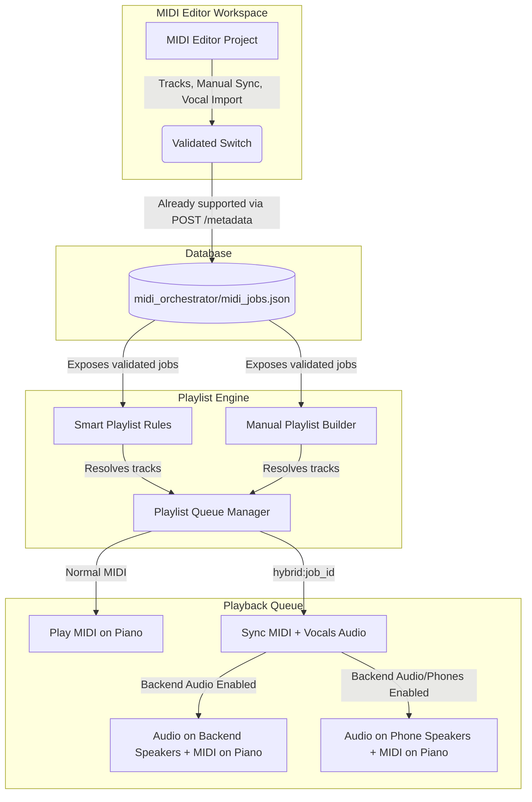

# 📋 Plan: MIDI Editor Songs Integration in Playlists

This plan outlines the architecture and implementation steps to integrate songs built in the **MIDI Editor** workspace (containing custom track routing, manual synchronization, and optional imported vocals) with static and dynamic (smart) playlists, playing them seamlessly alongside normal processed MIDI files.

---

## 🏗️ Architecture Overview

The system handles two distinct play types:
1. **Normal MIDI files:** Standard processed MIDI files stored in `storage/processed/` that play exclusively on the piano (or synthesize to WAV for mobile preview).
2. **MIDI Editor (Orchestrated) songs:** Workspace projects stored in `storage/midi_orchestrator/jobs/` and managed via `storage/midi_orchestrator/midi_jobs.json`. These contain manual synchronization offsets, custom track assignments (selective piano keys vs. backing speakers), and optional imported vocal tracks (originally separated by the MP3 Orchestrator).



---

## 🛠️ Step-by-Step Implementation Plan

### Phase 1: Expose Validated MIDI Editor Songs to Playlists

Since the `"validated"` boolean is already supported by the MIDI Editor's metadata endpoint (`/midi-orchestrator/metadata/{job_id}`), we can immediately utilize it to filter eligible songs.

#### 1. Integrate with Smart Playlist Rule Generator
In [main.py](file:///C:/Users/coren/Projects/MIDI-eval%20Times/player-piano-app/app/main.py#L696-L766), modify `generate_smart_playlist_logic` to pool both processed MIDI files and validated MIDI Editor projects. 

For each matching validated MIDI Editor project, we add a virtual URI `hybrid:{job_id}` to the playlist:
```python
def generate_smart_playlist_logic(name: str, filters: List[Dict[str, str]], exclude_dnu: bool):
    all_meta = utils.get_all_metadata()
    processed_files = [p.name for p in STORAGE_PROCESSED.iterdir() if p.suffix.lower() in ('.mid', '.midi')]
    
    # 1. Gather all candidates (Normal processed files + Validated MIDI Editor workspace songs)
    candidates = []
    for fn in processed_files:
        candidates.append({
            'id': fn,
            'meta': all_meta.get(fn, {})
        })
        
    from app.main import midi_orchestrator
    for job_id, job in midi_orchestrator.status.items():
        # Only pull completed and validated projects from the MIDI Editor workspace
        if job.get("status") == "completed" and job.get("validated", False):
            candidates.append({
                'id': f"hybrid:{job_id}",
                'meta': {
                    'artist': job.get('artist', 'Unknown'),
                    'genre': job.get('genre', ''),
                    'mood': job.get('mood', ''),
                    'source': job.get('source', ''),
                    'rating': job.get('rating', 0),
                    'dnu': job.get('dnu', False)
                }
            })
            
    to_add = []
    for item in candidates:
        track_id = item['id']
        meta = item['meta']
        
        if exclude_dnu and meta.get('dnu'):
            continue
            
        all_filters_match = True
        for f in filters:
            f_type = f.get('filter_type')
            f_val = f.get('filter_value', '')
            
            # (Keep existing dynamic rating and text filter matching)
            # ...
            
        if all_filters_match:
            to_add.append(track_id)
```

#### 2. Update Playlist manager Security Checks
In [manager.py](file:///C:/Users/coren/Projects/MIDI-eval%20Times/player-piano-app/app/manager.py#L73-L84), update `add_to_playlist` to validate virtual `hybrid:` track URIs before saving:
```python
    def add_to_playlist(self, name: str, filename: str):
        if name not in self.playlists:
            raise KeyError('no such playlist')
        
        is_valid_hybrid = False
        if filename.startswith("hybrid:"):
            job_id = filename.split(":", 1)[1]
            from app.main import midi_orchestrator
            is_valid_hybrid = job_id in midi_orchestrator.status and midi_orchestrator.status[job_id].get("validated", False)
            
        if not is_valid_hybrid and not (self.processed_dir / filename).exists():
            print(f"SECURITY: Blocked attempt to add invalid file '{filename}' to playlist '{name}'")
            return

        if filename not in self.playlists[name]:
            self.playlists[name].append(filename)
            self._save()
```

---

### Phase 2: Playback Sync & Speaker Handling

We must modify the playback thread in `PlaylistManager` to parse and delegate the hybrid paths (MIDI path + Audio path + Timing offsets) to the core player.

#### 1. Extend `play_midi_blocking` helper
In [utils.py](file:///C:/Users/coren/Projects/MIDI-eval%20Times/player-piano-app/app/utils.py#L958-L961), add `audio_path` and `global_offset_ms` parameters:
```python
def play_midi_blocking(path: str, port_name: str = None, stop_event=None, start_offset: float = 0, audio_path: str = None, global_offset_ms: float = 0):
    """Play MIDI file synchronously. Accepts optional threading.Event to allow interruption."""
    _play_internal(path, port_name, stop_event, start_offset, audio_path, global_offset_ms)
```

#### 2. Resolve Track URIs in Playlist Manager Worker Loop
In [manager.py](file:///C:/Users/coren/Projects/MIDI-eval%20Times/player-piano-app/app/manager.py#L125-L168), update the thread `worker` to extract the paths and settings dynamically:
```python
                    for i in range(self.current_index, len(self.active_tracks)):
                        if self._stop_requested:
                            break
                        
                        self.current_index = i
                        fn = self.active_tracks[i]
                        
                        audio_path = None
                        global_offset_ms = 0.0
                        
                        if fn.startswith("hybrid:"):
                            job_id = fn.split(":", 1)[1]
                            from app.main import midi_orchestrator
                            job = midi_orchestrator.status.get(job_id)
                            if not job:
                                continue
                            # Path to MIDI containing piano key tracks
                            path = job["midi"]
                            # Path to vocal/backing audio track
                            audio_path = job.get("vocals")
                            # Default to the job's manual sync offset if set
                            global_offset_ms = job.get("sync_offset", 0.0)
                        else:
                            path = self._resolve_path(fn)
                            
                        if not path or not os.path.exists(path): 
                            continue
                            
                        info = utils.get_midi_info(path)
                        self.current_file = fn
                        self.track_length = info.get('length')
                        self.start_time = time.time()
                        
                        # (Keep index offset calculation)
                        # ...

                        # Play with backing track parameters
                        utils.play_midi_blocking(
                            path, 
                            port_name, 
                            stop_event=self.stop_event, 
                            start_offset=current_offset,
                            audio_path=audio_path,
                            global_offset_ms=global_offset_ms
                        )
```

---

### Phase 3: Speaker Routing & Global Sync

Playback follows the user's active speaker route settings:

1. **Backend Speakers (`backend_audio_enabled = true`):**
   - The backend plays the backing audio on the backend speakers (via `_play_audio_thread` on the host PC).
   - The backend plays the keys on the piano (via BLE).
   - Sync is handled via `global_offset_ms` (which coordinates either MIDI or audio delays).
2. **Phone Speakers (`backend_audio_enabled = false`):**
   - The backend plays the keys on the piano (via BLE).
   - The phone polls `/queue/status`. When a `hybrid:{job_id}` track starts playing, the phone app automatically preloads the backing audio stream from `/midi-orchestrator/backing-audio/{job_id}` and plays it locally, keeping it synchronized with the queue's `elapsed` status.
